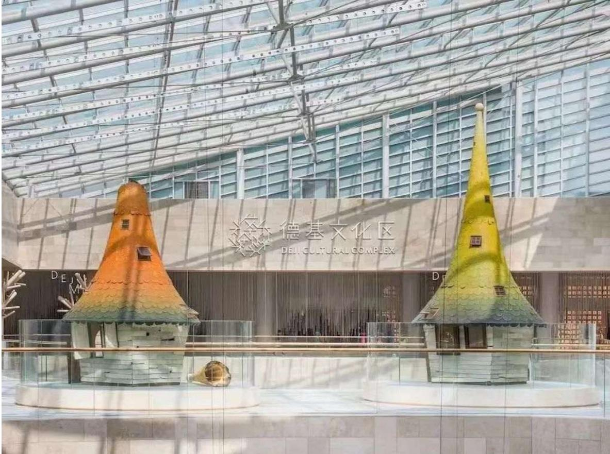

南京，作为中国四大古都之一，素有“六朝古都”“博爱之都”的美誉，是一座融合深厚历史文化与秀丽自然风光的城市。市内名胜众多，既有历史遗迹，也有山水园林，是旅游观光的绝佳目的地。

\*\*夫子庙—秦淮风光带\*\* 是南京最具代表性的文化地标之一，集古建筑、传统市井文化和秦淮河夜景于一体，夜晚灯火璀璨，游船穿梭，充满江南韵味。

\*\*钟山风景名胜区\*\* 汇聚了中山陵、明孝陵、灵谷寺等重要景点。其中，中山陵庄严肃穆，是纪念孙中山先生的重要场所；明孝陵则是明朝开国皇帝朱元璋的陵墓，已被列入世界文化遗产。

\*\*玄武湖\*\* 位于市中心，是江南地区最大的城内公园之一，湖光山色、四季皆美，尤以春季樱花和秋季银杏最为著名。

\*\*牛首山文化旅游区\*\* 以佛教文化为主题，拥有恢弘的佛顶宫与佛顶塔，是近年来备受游客青睐的新兴景点。

此外，\*\*南京博物院\*\* 馆藏丰富，是中国三大博物馆之一，全面展示了江苏乃至中华文明的发展历程；而\*\*侵华日军南京大屠杀遇难同胞纪念馆\*\* 则以沉痛的历史记忆提醒世人珍爱和平，是极具教育意义的重要场所。

无论你是历史爱好者、自然风光追寻者，还是文化探索者，南京都能为你提供一段难忘的旅程。

# 德基广场

